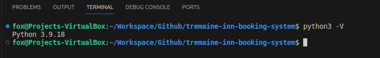
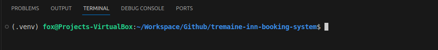
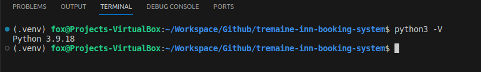

# Development

## Contents

- [Setup](#setup "Setup")

### Setup

The project was developed with **vscode** on local personal computer.

#### Set Python Version

For this project the python version was set to version 3.9.18 in vscode.

To confirm that the python version is set the command `python3 -V` was issued. The result is as shown below.



#### Setup Virtual Environment

Next run the terminal to setup the virtual environment. This was accomplished with this command as below

```command
python3 -m venv .venv
```

Rerun the terminal to ensure that virtual environment is active and is as shown below



and check that the python version is as it should be.



Next the libraries are installed.

#### Install Django and other Libraries

The first library to install is Django version 4.2 with this command:

```command
pip3 install Django~=4.2.1
```

Next the library: gunicorn is installed:

```command
pip3 install gunicorn
```

This is library is needed when the project is deployed to Heroku.

Next the library requirements are recorded in `requirements.txt` file by executing this command:

```command
pip3 freeze --local > requirements.txt
```

Next the project is created with this command:

```command
django-admin startproject tremaineinn .
```

Next the installation is tested. For details see [Development Setup section](TESTING.md) in the TESTING.md.

#### Creating Environment Variables

After testing was completed the `env.py` file was created. The contents is as below:

```python
import os

os.environ.setdefault('DATABASE_URL', '')
os.environ.setdefault('DEVELOPMENT_DEBUG', '1')
os.environ.setdefault(
    'SECRET_KEY',
    '<your secret key from settings.py>'
)
```

The the environment variables used in `env.py`.

| Environment variable | Contents                           | Purpose
| ---                  | ---                                | ---
| DATABASE_URL         | \<address of postgresql database>  | Address of the postgresql database instance
| DEVELOPMENT_DEBUG    | Set to either 0 or 1               | Set to 1 for development on local pc
|                      |                                    | Set to 0 on Heroku platform
| SECRET_KEY           | \<secret key in settings.py>       | Secret key taken from settings.py; this key will be different on Heroku platform

Initially `DATABASE_URL` will to be set to `''`. Later in the development cycle this will be set the local database instance on the pc and to the instance on ElephantSQL.

The `DEBUG` variable in `settings.py` is set as follows

```python
DEBUG = bool(os.environ.get('DEVELOPMENT_DEBUG') != '0')
```

By setting the `DEBUG` variable this way allows for frequent deployment to the production platform, i.e. Heroku, without constantly changing `DEBUG` from False to True and back again.

The `SECRET_KEY` will be set to the existing key in `settings.py` and will be changed at the end of development.

After creating the `env.py` and modifying `settings.py` the project tested again with `DEBUG` set to True and again with it set to False.

#### Deployment to Heroku

Next is to create the app on Heroku. The environment variables used on the local machine will also be set there. The exceptions is for the `DEVELOPMENT_DEBUG` which is set to '0'. Then the project is deployed. For details of deployment see [Deployment section](README.md#deployment "Deployment").

#### Final Deployment to Heroku

The variable `DEBUG` will be to False but just before final deployment.

```python
DEBUG = False
```

Afterwards the environment variable `DEVELOPMENT_DEBUG` will be removed from the 'Config Vars' on Heroku.
