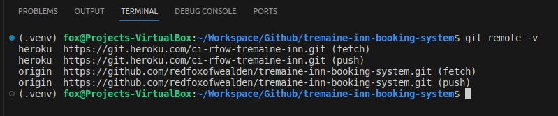

# Tremaine Inn

## Contents

- [About](#about "About")
- [UX Design](#ux-design "UX Design")
- [Features](#features "Features")
- [Development](#development "Development")
- [Technologies](#technologies "Technologies")
- [Testing](#testing "Testing")
- [Deployment](#deployment "Deployment")
- [References](#references "References")

## About

The Tremaine Inn, a **fictitious** inn, was developed as a student project for the Code Institute.

The Tremaine Inn is where customers can stay the night, have an evening meal or drink, or can have breakfast. The Inn caters mostly to business people, who just stay for one night, so that they can continue their journey to their destination. It also caters to holiday couples, who usually want to stay for one night, so that they can travel through to or return from their destination.

The purpose of the website is to allow the customer to book a room for the night on one or more occasions. The owner hopes that the customer will book the rooms through the website freeing him up to concentrate on managing the more important duties.

From now on in the document the customer will be referred to as the user.

- **NOTE**

The Tremaine Inn and all information about it is completely **fictitious** and **fabricated**.

## UX Design

### User Demographic

The website is expected to used by holiday makers and business people who want to book a room for the night and are traveling through.

### User Goal

The goal is for the user to book a room for one or more nights by using the website.

### Agile Development

#### Epics and User Stories

The epics and user stories have been created as issues on GitHub. These can be found here under [issues](https://github.com/redfoxofwealden/tremaine-inn-booking-system/issues).

The list of user stories can here under the epics below.

##### EPIC: Website UX

Link to the [EPIC: Website UX](https://github.com/redfoxofwealden/tremaine-inn-booking-system/issues/9) issue.

- [USER STORY: Home page (landing page)](https://github.com/redfoxofwealden/tremaine-inn-booking-system/issues/10)

##### EPIC: Booking Feature

Link to the [EPIC: Booking Feature](https://github.com/redfoxofwealden/tremaine-inn-booking-system/issues/1) issue.

- [USER STORY: Create User Account for Sign-In](https://github.com/redfoxofwealden/tremaine-inn-booking-system/issues/2)
- [USER STORY: Change Sign-In Details](https://github.com/redfoxofwealden/tremaine-inn-booking-system/issues/3)
- [USER STORY: Delete User Account](https://github.com/redfoxofwealden/tremaine-inn-booking-system/issues/4)
- [USER STORY: Book a Room](https://github.com/redfoxofwealden/tremaine-inn-booking-system/issues/5)
- [USER STORY: Change Booking(s)](https://github.com/redfoxofwealden/tremaine-inn-booking-system/issues/6)
- [USER STORY: Cancel Booking(s)](https://github.com/redfoxofwealden/tremaine-inn-booking-system/issues/7)
- [USER STORY: Website UI](https://github.com/redfoxofwealden/tremaine-inn-booking-system/issues/8)

All user stories are placed in the Product Backlog [here](https://github.com/redfoxofwealden/tremaine-inn-booking-system/milestone/2).

The user stories are arranged in order of importance the product backlog, the most important being placed at the top.

The four most important stories are then place into the first iteration milestone: [Iteration 1](https://github.com/redfoxofwealden/tremaine-inn-booking-system/milestone/3). From there all user stories are placed on the Todo board in the [Project Board](https://github.com/users/redfoxofwealden/projects/6).

### Wireframes

Wireframe for Home page.


Wireframe for Sign-In page.


Wireframe for Register page.


Wireframe for User Account page.


Wireframe for Bookings page.


### Entity Relationship Diagram


## Features

### Existing Features

Home page.

Sign-In page.

Register page.

Booking page.

### Future Features

- Payment system to collect deposit for booking rooms from users
- Notify users to confirm bookings by text message and email

## Technologies

### Languages Used

- HTML
- CSS
- Javascript
- Python

### Libraries Used

- Bootstrap 5
- jQuery
- Django

### Database

- Postgresql, hosted on ElephantSQL for production.
- Postgresql, hosted on local computer for development and testing.

## Development

### Setup

The project was developed with **vscode** on local personal computer.

#### Set Python Version

For this project the python version was set to version 3.9.18 in vscode.

To confirm that the python version is set the command `python3 -V` was issued. The result is as shown below.


#### Setup Virtual Environment

Next run the terminal to setup the virtual environment. This was accomplished with this command as below

```command
python3 -m venv .venv
```

Rerun the terminal to ensure that virtual environment is active and is as shown below


and check that the python version is as it should be.


Next the libraries are installed.

#### Install Django and other Libraries

The first library to install is Django version 4.2 with this command:

```command
pip3 install Django~=4.2.1
```

Next the library: gunicorn is installed:

```command
pip3 install gunicorn
```

This is library is needed when the project is deployed to Heroku.

Next the library requirements are recorded in `requirements.txt` file by executing this command:

```command
pip3 freeze --local > requirements.txt
```

Next the project is created with this command:

```command
django-admin startproject tremaineinn .
```

Next the installation is tested. For details see [Development Setup section](TESTING.md) in the TESTING.md.

#### Creating Environment Variables

After testing was completed the `env.py` file was created. The contents is as below:

```python
import os

os.environ.setdefault('DATABASE_URL', '')
os.environ.setdefault('DEVELOPMENT_DEBUG', '1')
os.environ.setdefault(
    'SECRET_KEY',
    '<your secret key from settings.py>'
)
```

The the environment variables used in `env.py`.

| Environment variable | Contents                           | Purpose
| ---                  | ---                                | ---
| DATABASE_URL         | \<address of postgresql database>  | Address of the postgresql database instance
| DEVELOPMENT_DEBUG    | Set to either 0 or 1               | Set to 1 for development on local pc
|                      |                                    | Set to 0 on Heroku platform
| SECRET_KEY           | \<secret key in settings.py>       | Secret key taken from settings.py; this key will be different on Heroku platform

Initially `DATABASE_URL` will to be set to `''`. Later in the development cycle this will be set the local database instance on the pc and to the instance on ElephantSQL.

The `DEBUG` variable in `settings.py` is set as follows

```python
DEBUG = bool(os.environ.get('DEVELOPMENT_DEBUG') != '0')
```

By setting the `DEBUG` variable this way allows for frequent deployment to the production platform, i.e. Heroku, without constantly changing `DEBUG` from False to True and back again.

The `SECRET_KEY` will be set to the existing key in `settings.py` and will be changed at the end of development.

After creating the `env.py` and modifying `settings.py` the project tested again with `DEBUG` set to True and again with it set to False.

#### Deployment to Heroku

Next is to create the app on Heroku. The environment variables used on the local machine will also be set there. The exceptions is for the `DEVELOPMENT_DEBUG` which is set to '0'. Then the project is deployed. For details of deployment see [Deployment section](#deployment "Deployment").

#### Final Deployment to Heroku

The variable `DEBUG` will be to False but just before final deployment.

```python
DEBUG = False
```

Afterwards the environment variable `DEVELOPMENT_DEBUG` will be removed from the 'Config Vars' on Heroku.

## Testing

The details of the testing can be found [here in TESTING.md](TESTING.md).

## Deployment

The deployment was carried out after creating the app `ci-rfow-tremaine-inn` on Heroku. The deployment is carried using the Heroku toolbelt.

Before deployment three files are required:

- Procfile
- runtime.txt
- requirements.txt

The `Procfile` contains the following:

```command
web: gunicorn tremaineinn.wsgi
```

The file is required to run Django on Heroku.

The `runtime.txt` file contains information about the version of python to install:

```command
python-3.9.18
```

The `requirements.txt` would have been created during the project setup.

After these files have been created, the project can be deployed.

To deploy do the following steps in order:

Login to Heroku with this command in terminal:

```command
heroku login
```

After the command is issued the browser opens up to the Heroku log-in website. You are required to login and authenticate. After the login and authentication process has been completed successfully, you can close the browser and return to the terminal.

To confirm that you are logged-in issue the command:

```command
heroku apps
```

If you see a list of apps you are logged-in.

Next connect to Heroku app created `ci-rfow-tremaine-inn` with the command:

```command
heroku git:remote --app ci-rfow-tremaine-inn
```

To confirm that there is a remote connection with the app by the command:



Now that heroku app is connected, the project can be deployed by issuing the command:

```command
git push heroku main
```

The project is now deployed and can be accessed [here](https://ci-rfow-tremaine-inn-dd9cc09a704a.herokuapp.com/).

## References

### Resources

[Draw.io](https://www.drawio.com/) was used to create the wireframes and entity relationship diagrams.

The format and sections included in the README and TESTING documents was inspired from these videos:-

- [Portfolio Project 4: The guide to MVP](https://www.youtube.com/watch?v=vIv1c6RLBac)
- [README.md - Manual Testing Write Up Overview](https://www.youtube.com/watch?v=Q66HZgkDSOo)

The guide to develop the project was inspired from [Django Blog Webinar](https://www.youtube.com/watch?v=YH--VobIA8c) and from the module in the LMS: "Learning to Develop with Django".

The following articles from Heroku helped me to understand why the libraries, gunicorn and whitenoise was needed:

- [Configuring Django Apps for Heroku](https://devcenter.heroku.com/articles/django-app-configuration)
- [Django and Static Assets](https://devcenter.heroku.com/articles/django-assets)

### Credits
