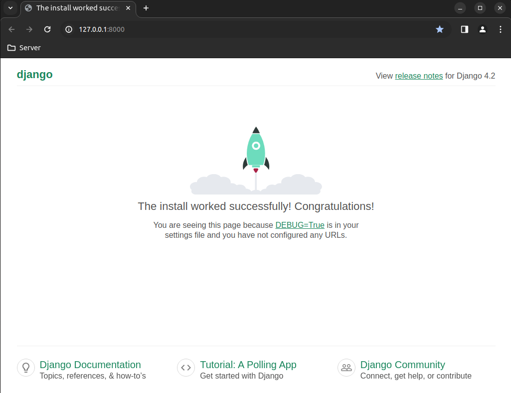
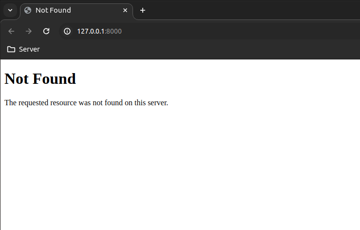

# Testing

## Contents

- [Development Setup](#development-setup "Development Setup")
- [User Story Testing](#user-story-testing "User Story Testing")
- [Features Testing](#features-testing "Features Testing")
- [Browser Compatibility](#browser-compatibility "Browser Compatibility")
- [Responsiveness](#responsiveness "Responsiveness")
- [Code Validation](#code-validation "Code Validation")
- [Bugs](#bugs "Bugs")
- [Lighthouse](#lighthouse "Lighthouse")

back to [README](README.md)

## Development Setup

### Django setup

After creating the project in Django it was tested. The result is as shown below:



After creating the environment variables these were tested.

### Test environment variables

Initially the global variable `DEBUG` in `settings.py` was set as below:

```python
DEBUG = bool(os.environ.get('DEVELOPMENT_DEBUG'))
```

However it resulted in a bug as below

| Bug | Description | Solution applied | Result
| --- | ---         | ---              | ---
| DEBUG was always to True, even if DEVELOPMENT_DEBUG was set to '0'| The result was as shown in the previous section above | By altering the code as below | The result as shown below

The code was correct to as below:

```python
DEBUG = bool(os.environ.get('DEVELOPMENT_DEBUG') != '0')
```

Screen shot of the result after fixing the bug:



The reason for message shown above is that the home page has not been created. This will be fixed when development on the first user story is worked on.

## User Story Testing

### Create User Account for Sign-In

### Change Sign-In Details

### Delete User Account

### Book a Room

### Change Booking(s)

### Cancel Booking(s)

### Website UI

## Features Testing

| Feature    | Test Case         | Outcome
| ---        | ---               | ---
| Logo                | Click on the logo                      | User is brought to the Home Page
| Navbar \| Home Page | Click on the Home link on each page    | User is brought to the Home page
| Navbar \| Gallery   | Click on the Gallery link on each page | User is brought to the Gallery page
| Contact Form        | Submit an empty form                   | Error signalling required fields

## Browser Compatibility

| Browser Tested  | Intended Appearance | Intended Responsiveness
| ---             | ---                 | ---
| Chrome          | Good                | Good
| Firefox         | Good                | Good
| Edge            | Fair                | Fair

## Responsiveness

| Device Tested       | Site >= 700px   | Site < 699px      | Renders as Expected
| ---                 | ---             | ---               | ---
| iPhone 5            | N/A             | Good              | Good & Fair
| iPad Pro            | Fair            | N/A               | Fair
| Desktop 1024px      | Good            | N/A               | Good
| Desktop 4K          | Works           | Doesn't work      | Poor

## Code Validation

| Page Tested | Screenshot of errors | Solution applied | Screenshot of clear Validator output
| ---         | ---                  | ---              | ---
| About.html  | screenshot image     | solution         | screenshot of clear output

## Bugs

| Bug | Description | Solution applied | Result
| --- | ---         | ---              | ---
| Outline of the bug | How it affects the site? (screenshots) | How did you fix the issue? | What is the result, was it solved? (screenshot if applicable)

### Bugs Resolved

### Bugs Unresolved

## Lighthouse

| View Tested | Outcome of the audit | Solution applied | Screenshot of clear Validator output
| ---         | ---                  | ---              | ---
| Mobile      | (screenshot)         | Errors were fixed by (solution) | (screenshot)
| Desktop     | (screenshot)         | Errors were fixed by (solution) | (screenshot)
